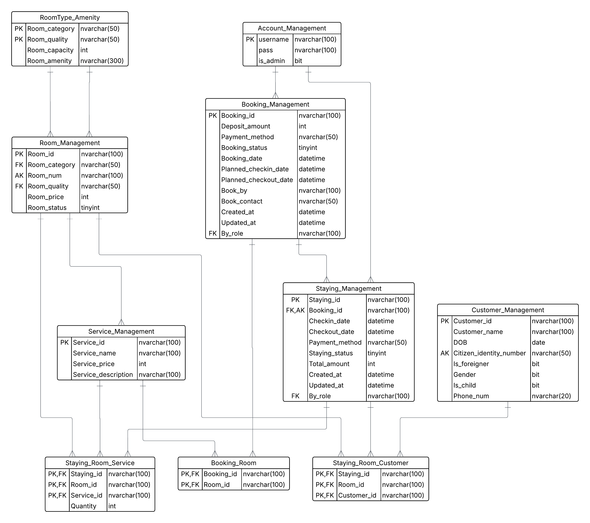

# 🏨 Hotel Management System - System Overview
## Chức năng chính

### 1. Quản lý Phòng

- Xem danh sách phòng
- Thêm/sửa/xóa phòng
- Cập nhật trạng thái phòng (Empty, Occupied, Cleaning)
- Phân loại phòng (Single, Double, Suite)
- Quản lý tiện ích của phòng

### 2. Quản lý Khách hàng

- Thêm/sửa/xóa thông tin khách hàng
- Tìm kiếm khách hàng
- Phân loại khách hàng (Việt Nam/Nước ngoài/Người lớn/Trẻ em)
- Quản lý thông tin cá nhân

### 3. Quản lý Đặt phòng

- Tạo đặt phòng mới
- Cập nhật trạng thái đặt phòng
- Quản lý thông tin thanh toán
- Theo dõi lịch sử đặt phòng

### 4. Quản lý Check-in/Check-out

- Xử lý check-in khách hàng
- Xử lý check-out và thanh toán
- Quản lý thời gian lưu trú
- Theo dõi trạng thái phòng

### 5. Quản lý Dịch vụ

- Thêm/sửa/xóa dịch vụ
- Quản lý giá dịch vụ
- Theo dõi dịch vụ sử dụng

### 6. Quản lý Tiện ích

- Thêm/sửa/xóa tiện ích
- Quản lý số lượng tiện ích
- Phân bổ tiện ích cho phòng

### 7. Báo cáo và Thống kê

- Thống kê phòng (tỷ lệ sử dụng, phân loại)
- Thống kê đặt phòng (số lượng, tỷ lệ hủy)
- Thống kê doanh thu
- Báo cáo khách hàng
- Báo cáo sử dụng phòng

### 8. Quản lý Tài khoản

- Đăng nhập/đăng xuất
- Phân quyền (Admin/Staff)
- Thay đổi mật khẩu
- Quản lý tài khoản

## Tổng quan hệ thống

Hệ thống Quản lý Khách sạn đã được cải tiến hoàn toàn để đáp ứng đầy đủ cấu trúc database từ file `Hotel.sql`. Hệ thống bao gồm các chức năng chính sau:

## Cấu trúc Database

### 1. Bảng chính (Core Tables)

- **Room_Management**: Quản lý phòng (ID, loại, số phòng, chất lượng, giá, trạng thái)
- **Customer_Management**: Quản lý khách hàng (thông tin cá nhân, quốc tịch, giới tính)
- **Booking_Management**: Quản lý đặt phòng (thông tin đặt phòng, trạng thái, thanh toán)
- **Staying_Management**: Quản lý thời gian lưu trú (check-in, check-out, thanh toán)
- **Service_Management**: Quản lý dịch vụ (tên dịch vụ, giá)
- **Amenity_Management**: Quản lý tiện ích (tên, mô tả, số lượng)
- **Account_Management**: Quản lý tài khoản (username, password, quyền admin)

### 2. Bảng quan hệ (Relationship Tables)

- **Staying_Room_Customer**: Liên kết khách hàng, phòng và thời gian lưu trú
- **Staying_Service**: Dịch vụ sử dụng trong thời gian lưu trú
- **Room_Amenity**: Tiện ích của từng phòng
- **Booking_Room**: Liên kết đặt phòng và phòng
- **Staying_Room**: Liên kết thời gian lưu trú và phòng




# 🏨 Hotel Management System - Database & Business Backend Flow
## Kiến trúc hệ thống
### 1. Model Layer
- **Room.java**: Model cho phòng (`Room_Management`, `RoomType_Amenity`)
- **Customer.java**: Model cho khách hàng (`Customer_Management`)
- **Booking.java**: Model cho đặt phòng (`Booking_Management`)
- **Staying.java**: Model cho thời gian lưu trú (`Staying_Management`)
- **Service.java**: Model cho dịch vụ (`Service_Management`, `Staying_Service`)
- **Account.java**: Model cho tài khoản (`Account_Management`)

### 2. Repository Layer
- **RoomRepository**: CRUD cho phòng, kiểm tra trạng thái trống/đầy
- **CustomerRepository**: CRUD cho khách hàng, quản lý trẻ em
- **BookingRepository**: CRUD cho booking, quản lý Booking_Room
- **StayingRepository**: CRUD cho staying
- **ServiceRepository**: CRUD cho dịch vụ
- **AccountRepository**: Authentication
- **StayingServiceRepository**: Quản lý dịch vụ trong thời gian lưu trú
- **StayingRoomCustomerRepository**: Quản lý mối quan hệ khách-phòng-staying

### 3. Service Layer
- **HotelService**: Xử lý business logic chung, check room availability, tính tổng tiền
- **AuthService**: Authentication / Authorization
- **ReportService**: Thống kê, báo cáo

### 4. Utility Layer
- **IdGenerator**: Sinh tự động `Room_id`, `Customer_id`, `Booking_id`, `Staying_id`, `Service_id`
- **ValidationUtil**: Kiểm tra input, số lượng khách ≤ `Room_capacity`
- **CommonUtil**: Các hàm tiện ích chung


## Cách sử dụng

### Khởi tạo Database

```sql
-- Chạy file Hotel.sql để tạo database và dữ liệu mẫu Sample_data.sql (Microsoft SQL Server)
-- Chạy Project thông qua Netbeans IDE
```


# 🏨 Hotel Management System - Database & Business Frondend Flow

## 📌 Tổng quan
Hệ thống quản lý khách sạn với các nghiệp vụ chính:
- Đặt phòng (**Booking**)
- Nhận phòng (**Check-in**)
- Quản lý khách ở (**Staying**)
- Trả phòng & thanh toán (**Check-out**)

Database đã tối giản và đủ để code giao diện frontend.

---

## 🔗 Flow nghiệp vụ

### 1️⃣ Booking (Đặt phòng trước)
- **Input (Frontend form):**
  - Người đặt: `Book_by`, `Book_contact`
  - Thông tin phòng: loại, ngày check-in/out, số lượng khách
- **DB:**
  - Ghi vào `Booking_Management`
  - Liên kết phòng → `Booking_Room`
- **Trạng thái:** Pending / Confirmed / Cancelled

---

### 2️⃣ Check-in (Khách tới nhận phòng)
- **Input (Frontend form):**
  - Chọn booking (nếu có) → xác nhận khách đến
  - Nếu walk-in (không booking) → tạo trực tiếp `Staying_Management`
  - Thêm danh sách khách → `Staying_Room_Customer` (link tới `Customer_Management`)
- **DB:**
  - Booking → Checked-in
  - Tạo mới `Staying_Management`
  - Gán phòng → `Staying_Room_Customer`

---

### 3️⃣ Staying (Trong thời gian khách ở)
- **Frontend:**
  - Dashboard danh sách khách đang ở
  - Order dịch vụ → `Staying_Service`
- **DB:**
  - Phòng → trạng thái Occupied
  - Dịch vụ → cộng dồn vào bill tạm tính

---

### 4️⃣ Check-out (Khách trả phòng)
- **Input (Frontend form):**
  - Chọn staying → tạo hóa đơn
  - Kiểm tra dịch vụ đã dùng (`Staying_Service`)
  - Tổng hợp tiền phòng + dịch vụ
- **DB:**
  - `Staying_Management` → status = Checked-out
  - Phòng → Empty
  - Xuất hóa đơn (có thể thêm bảng `Invoice` nếu cần)

---

## Liên hệ
Để biết thêm thông tin hoặc hỗ trợ, vui lòng liên hệ team phát triển.
